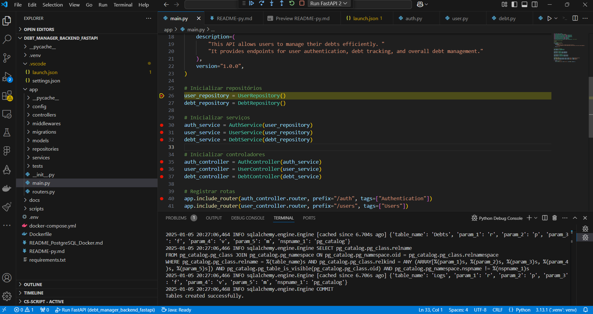
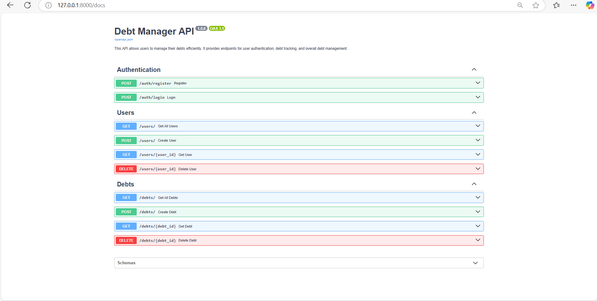

# Backend (debt-manager-backend-fastapi)

- REST API using FastAPI with JWT Authentication
- Backend for TaqTaq Core results

## Features

- REST API with FastAPI and JWT Authentication.
- Backend for managing Regulatory Processing System results.

## Python Layer Model (Universal Reference Architecture)

```plaintext
.github/                	# GitHub Actions configuration or other workflow settings
.vscode/                	# Visual Studio Code-specific configuration
app/                    
    __pycache__/        	# Compiled Python files
    config/             	# Configuration files (database, application settings, etc.)
    controllers/        	# API endpoints
    interfaces/         	# Interfaces for abstractions (optional, for dependency injection)
    middlewares/        	# HTTP Middlewares
    migrations/         	# Database migrations
    models/             	# Database and domain models
    repositories/       	# Data persistence and access logic
    routers/            	# Route configuration for the API
    servers/            	# Server-specific logic (e.g., startup tasks, shutdown handlers)
    services/           	# Business logic services
    tests/              	# Unit and integration tests
    __init__.py         	# Package initialization
main.py                 	# Main application (entry point)
setup.py                	# Setup configuration for the package
.env                    	# Environment variables file
docs/                   	# Project documentation
scripts/                	# Automation scripts
docker-compose.yml      	# Docker Compose file for multi-container configuration
Dockerfile              	# Dockerfile for image building
README_PostgreSQL_Docker.md # Additional README for PostgreSQL Docker setup
README-py.md            	# Project description
requirements.txt        	# Python dependencies
```

## Main Technologies Used - API (Backend Microservices)

&#x20;  &#x20;

---

## Environment Prerequisites

- **Python**: Version 3.10 or higher
- **Docker**: Containerization
- **PostgreSQL**: Relational database
- **MongoDB**: NoSQL database
- **VSCode**: Code editor

---

## Environment Setup

### Download the application code

```bash
git clone https://github.com/your-repo/debt-manager-backend-fastapi.git
```

### Create a virtual environment and install dependencies

```bash
python -m venv venv
source venv/bin/activate  # Linux/Mac
venv\Scripts\activate     # Windows
pip install -r requirements.txt
```

### Install Docker dependencies

```bash
docker-compose up --build
```

### Run the application locally

```bash
uvicorn app.main:app --reload
```

### Install Python dependencies manually (optional)

To install the Python dependencies individually:

```bash
pip install Flask_Migrate
pip install Mako
pip install MarkupSafe
pip install PyJWT
pip install SQLAlchemy
pip install alembic
pip install annotated_types
pip install anyio
pip install asyncpg
pip install blinker
pip install click
pip install colorama
pip install debugpy
pip install dns
pip install dotenv
pip install email_validator
pip install fastapi
pip install flask
pip install flask_sqlalchemy
pip install h11
pip install idna
pip install iniconfig
pip install itsdangerous
pip install jinja2
pip install mako
pip install markupsafe
pip install multipart
pip install packaging
pip install pip
pip install pkg_resources
pip install pluggy
pip install psycopg2
pip install pydantic
pip install pytest
pip install pytest_asyncio
pip install python_multipart
pip install setuptools
pip install sniffio
pip install starlette
pip install uvicorn
pip install werkzeug
```

### Swagger URL

```plaintext
http://localhost:8000/docs
```

---

## Dependencies

Install dependencies in `requirements.txt`:

```plaintext
fastapi
uvicorn
python-jose
passlib[bcrypt]
pydantic
sqlalchemy
databases
```

### Additional Libraries

```plaintext
pytest
docker
```

---

## Docker Compose Configuration

```yaml
version: '3.9'
services:
  app:
    build: .
    ports:
      - "8000:8000"
    volumes:
      - .:/code
    environment:
      - DATABASE_URL=postgresql://postgres:postgres@db:5432/debt_database
  db:
    image: postgres:15.3
    ports:
      - "5432:5432"
    environment:
      POSTGRES_USER: postgres
      POSTGRES_PASSWORD: postgres
      POSTGRES_DB: debt_database
  mongo:
    image: mongo
    ports:
      - "27017:27017"
    environment:
      MONGO_INITDB_ROOT_USERNAME: root
      MONGO_INITDB_ROOT_PASSWORD: root
```

## Debug

Debugging can be done via VSCode:



## Access Mode: NoSQL, SQL and REST API

- Localhost: [Swagger local machine](http://127.0.0.1:8000/docs)
  


---


## Access Mode: NoSQL, SQL and REST API

- Localhost: [Swagger local machine](http://127.0.0.1:8000/docs)&#x20;

---

## Access

- **Swagger Documentation**: [Localhost Swagger](http://localhost:8000/docs)
- **MongoDB Compass**: [MongoDB Compass](https://www.mongodb.com/products/compass)
- **DBeaver PostgreSQL**: [DBeaver](https://dbeaver.io/)

---

## Multi-Cloud, On-Premises, and Data Center Environment List

- Development: `environment-dev`
- Staging: `environment-hml`
- QA: `environment-qa`
- Production: `environment-prod`

---
