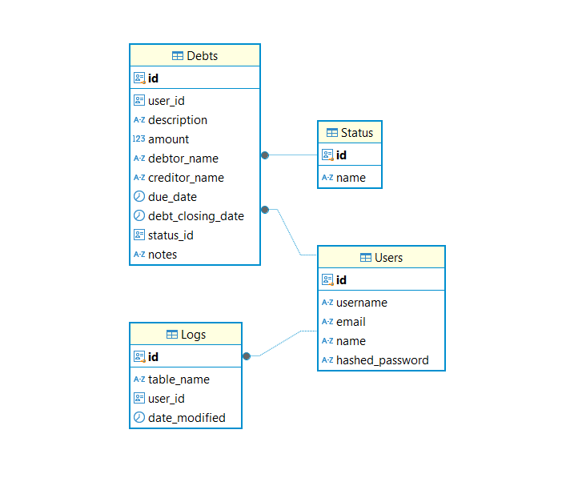

# PostgreSQL Docker Setup

This repository provides instructions and configuration to set up PostgreSQL in a Docker container.

---

## **Prerequisites**

- [Docker](https://www.docker.com/) installed on your system.
- Basic understanding of PostgreSQL.

---

## **Setup Instructions**

### **Step 1: Pull the PostgreSQL Docker Image**
Run the following command to download the PostgreSQL image from Docker Hub:

```bash
docker pull postgres
```

---

### **Step 2: Start the PostgreSQL Container**
Use the following command to start the PostgreSQL container:

```bash
docker run --name my_postgres \
  -e POSTGRES_USER=myuser \
  -e POSTGRES_PASSWORD=mypassword \
  -e POSTGRES_DB=debt_database \
  -p 5432:5432 \
  -d postgres
```

#### Environment Variables:
- `POSTGRES_USER`: Sets the PostgreSQL username (default: `postgres`).
- `POSTGRES_PASSWORD`: Sets the PostgreSQL password.
- `POSTGRES_DB`: Creates a default database with the specified name.

---

### **Step 3: Verify the Container**
Check the status of the PostgreSQL container:

```bash
docker ps
```

---

### **Step 4: Connect to PostgreSQL**
#### Option 1: Using `psql` CLI
Access the PostgreSQL container shell and connect to the database:

```bash
docker exec -it my_postgres psql -U myuser -d debt_database
```

#### Option 2: Using GUI Clients
Connect to PostgreSQL using a GUI client (e.g., pgAdmin or DBeaver):

- **Host**: `localhost`
- **Port**: `5432`
- **Username**: `myuser`
- **Password**: `mypassword`
- **Database**: `debt_database`

---

## **Persistent Storage (Optional)**

To ensure that your data persists beyond container removal, mount a volume when starting the container:

```bash
docker run --name my_postgres \
  -e POSTGRES_USER=myuser \
  -e POSTGRES_PASSWORD=mypassword \
  -e POSTGRES_DB=debt_database \
  -p 5432:5432 \
  -v my_postgres_data:/var/lib/postgresql/data \
  -d postgres
```

This uses a Docker volume (`my_postgres_data`) to store the database files.

---

## **Stopping and Removing the Container**

### Stop the container:
```bash
docker stop my_postgres
```

### Remove the container:
```bash
docker rm my_postgres
```

### Remove the volume (if used):
```bash
docker volume rm my_postgres_data
```

---

## **Customization**

You can modify the environment variables and volume settings in the `docker run` command to suit your requirements.

---

## **Troubleshooting**

- If the container fails to start, check the logs for errors:
  ```bash
  docker logs my_postgres
  ```

- Ensure that port `5432` is not being used by another service.

---

## **Database Model (DER) Postgres (v.01.b)



---

## **References**

- [PostgreSQL Official Documentation](https://www.postgresql.org/docs/)
- [Docker Hub: PostgreSQL Image](https://hub.docker.com/_/postgres)
